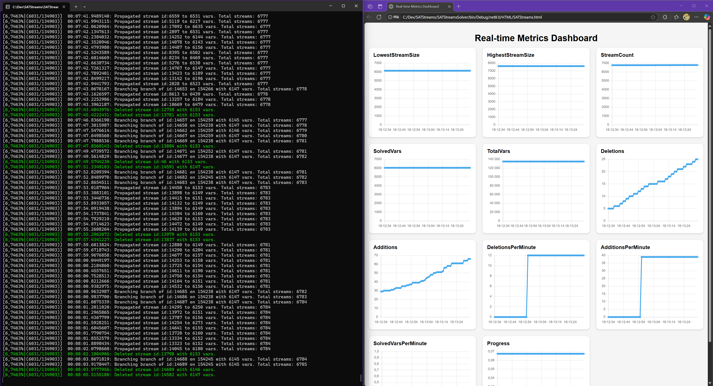

# SATStreams



## Overview

**SATStreams** is a concurrent SAT‑solving library and command‑line solver written in modern C# (.NET 8). It treats each partial assignment as a lightweight **stream** and explores them in parallel while leveraging the **Z3** SMT back‑end for fast satisfiable/unsatisfiable checks. The project provides both a reusable library and a ready‑to‑use CLI tool.

## Key Features

- **DIMACS CNF parser** – load standard `.cnf` files with a single call.
- **Multi‑threaded search** using independent *streams* that merge, branch, and prune dynamically to accelerate convergence.
- **Incremental unit propagation** and fast Boolean constraint propagation implemented in pure C#.
- **Integration with Z3** for efficient consistency checking of candidate assignments.
- **Checkpointing** – the solver automatically writes checkpoints every 5 min and at exit, so long‑running jobs can be resumed later.
- **Optional visualisation server** (`localhost:8888`) that exposes solver state as JSON and launches an HTML dashboard.
- **Colourised progress logging** with deletions, merges, and branching stats.
- **MIT‑licensed** and cross‑platform (.NET 8).

## Repository Layout

| Path                | Description                                         |
| ------------------- | --------------------------------------------------- |
| `SATStreams/`       | Core library (CNF parser, `SATSolver`, utilities).  |
| `SATStreamsSolver/` | CLI front‑end using **clipr** for argument parsing. |
| `HTML/`             | Single‑page dashboard for real‑time visualisation.  |
| `checkpoints/`      | Created at runtime to store solver states.          |

## Building

```bash
# Clone & restore NuGet packages
git clone https://github.com/komorra/SATStreams.git
cd SATStreams

# Build everything (Release)
dotnet build -c Release
```

## Running the CLI Solver

```bash
# Solve a DIMACS file in place
dotnet run --project SATStreamsSolver -- sample.cnf
```

While running you will see colourised logs and a progress bar. If `--visual` is enabled (default), your browser opens the dashboard.

### CLI Options

| Flag               | Default      | Purpose                                   |
| ------------------ | ------------ | ----------------------------------------- |
| `-i, --input`      | *(required)* | Path to `.cnf` file.                      |
| `--no-checkpoints` | false        | Disable writing checkpoints.              |
| `--no-visual`      | false        | Do not start the visualisation server.    |
| `--fast-threads`   | 4            | Count of fast Z3 threads (short timeout). |
| `--slow-threads`   | 1            | Count of slow Z3 threads (long timeout).  |

## Using the Library

```csharp
var cnf = Utils.FromFile("samples/uf20-01.cnf");
var solver = new SATSolver(cnf)
{
    HostVisualisationServer = false,
    UseCheckpoints = true
};
var solution = solver.Solve();
if (solution != null)
{
    Console.WriteLine($"Solved! {string.Join(" ", solution)}");
}
```

## Checkpoint Format

Each checkpoint directory is named after the SHA‑256 hash of the input CNF. It contains one `.cnf` file per active stream, a `solution.cnf` with the currently agreed literals, and an `activeids.txt` listing still‑alive stream IDs.

## Contributing

1. **Fork** the repo and create a feature branch.
2. Write unit or integration tests where possible.
3. Follow the existing code style (nullable enabled, `var` when obvious).
4. Submit a pull request – all PRs are welcome!

## License

Distributed under the MIT License. See `LICENSE` for more information.

---

Made with ❤️ by Komorra

